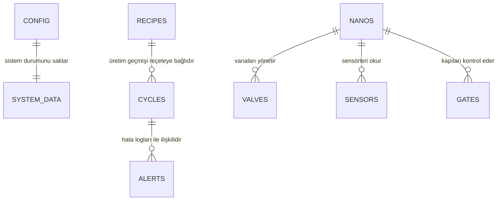

# GazozFab Otomasyon Projesi - Veritabanı Şeması Tasarımı (SQLite)

Bu dosya, tüm otomasyon sisteminin (Valfler, Sensörler, Kilitler, Arduino Nano'lar, Reçeteler ve Sistem Konfigürasyonu) dinamik olarak yönetilebilmesi ve SQLite üzerinde saklanabilmesi için tasarlanan veritabanı şemasını içerir.

---

## 📊 İlişkisel Tablolar ve Şema Yapısı

---

### 1. Sistem Yapılandırma Tablosu (`system_config`)
Tüm genel otomasyon parametrelerini saklar. Tek satırlık (`id = 1`) bir tablodur.

| Kolon Adı | Veri Tipi | Kısıtlar | Açıklama |
| :--- | :--- | :--- | :--- |
| `id` | INTEGER | PRIMARY KEY | Benzersiz ID (Her zaman 1) |
| `recipeId` | TEXT | DEFAULT '' | Aktif reçetenin ID'si |
| `volumeMl` | INTEGER | DEFAULT 0 | Aktif şişe hacmi (ml) |
| `targetCount` | INTEGER | DEFAULT 0 | Aktif hedef dolum şişe adedi |
| `fillTimeMs` | INTEGER | DEFAULT 0 | Aktif valf dolum süresi (ms) |
| `settlingTimeMs` | INTEGER | DEFAULT 0 | Aktif durulma bekleme süresi (ms) |
| `dripWaitTimeMs` | INTEGER | DEFAULT 0 | Aktif damlama bekleme süresi (ms) |
| `inputDebounceMs` | INTEGER | DEFAULT 50 | Giriş sensör filtre filtresi (ms) |
| `outputDebounceMs` | INTEGER | DEFAULT 50 | Çıkış sensör filtre filtresi (ms) |
| `gateSpeedPercent` | INTEGER | DEFAULT 100 | Step motor kapı hız yüzdesi (%) |
| `watchdogTimeoutMs` | INTEGER | DEFAULT 15000 | Sistem bekçi köpeği zaman aşımı (ms) |
| `maxRetries` | INTEGER | DEFAULT 3 | Arduino iletişim hata tekrarlama sınırı |
| `relayInversion` | BOOLEAN | DEFAULT 0 | Röle tetikleme mantığı (0: Active High, 1: Active Low) |
| `autoRecovery` | BOOLEAN | DEFAULT 1 | Hata sonrası otomatik kurtarma aktif mi? |
| `manualValveMaxOpenTimeMs` | INTEGER | DEFAULT 5000 | Operatör modunda vananın maks açık kalma süresi |
| `logLevel` | TEXT | DEFAULT 'INFO' | Hata/Olay günlük seviyesi (`DEBUG`, `INFO`, `WARN`, `ERROR`) |
| `heartbeatIntervalMs` | INTEGER | DEFAULT 5000 | Arduino'lar ile el sıkışma sıklığı (ms) |
| `enableMqtt` | BOOLEAN | DEFAULT 0 | MQTT protokolü üzerinden yayın aktif mi? |
| `mqttBrokerUrl` | TEXT | DEFAULT '' | MQTT Broker sunucu adresi |
| `autoCleanEnabled` | BOOLEAN | DEFAULT 0 | Otomatik temizlik döngüsü aktif mi? |
| `autoCleanIntervalCount` | INTEGER | DEFAULT 0 | Kaç dolumda bir temizlik yapılacağı |
| `maxTemperatureThreshold` | REAL | DEFAULT 60.0 | Maksimum sıcaklık sınırı güvenlik eşiği |
| `voltageWarningLimit` | REAL | DEFAULT 12.0 | Düşük voltaj uyarı limiti |
| `emergencyStopBehavior` | TEXT | DEFAULT 'SAFE_HOME'| Acil durdurmada motor davranışı (`FREEZE`, `RELEASE_PRESSURE`, `SAFE_HOME`) |
| `washDurationMs` | INTEGER | DEFAULT 30000 | Yıkama/Temizleme modu toplam süresi (ms) |
| `washValveIntervalMs` | INTEGER | DEFAULT 2000 | Yıkama esnasında valf geçiş aralığı (ms) |
| `ultrasonicDevice` | TEXT | DEFAULT 'RASPI' | Seviye sensörünün bağlı olduğu denetleyici ID |
| `ultrasonicTrigPin` | TEXT | DEFAULT '23' | Seviye sensörü TRIG pini (GPIO veya D pin adı) |
| `ultrasonicEchoPin` | TEXT | DEFAULT '24' | Seviye sensörü ECHO pini (GPIO veya D pin adı) |
| `ultrasonicMaxHeightCm` | INTEGER | DEFAULT 100 | Şerbet tankının tavan-taban boyu (cm) |
| `ultrasonicCriticalLowPercent`| INTEGER | DEFAULT 15 | Kritik alt limit doluluk yüzdesi (%) |
| `ultrasonicDebounceMs` | INTEGER | DEFAULT 100 | Seviye sensörü okuma kararlılık gecikmesi (ms) |

---

### 2. Reçeteler Tablosu (`recipes`)
Üretim reçetelerini ve dolum parametrelerini saklar.

| Kolon Adı | Veri Tipi | Kısıtlar | Açıklama |
| :--- | :--- | :--- | :--- |
| `id` | TEXT | PRIMARY KEY | Benzersiz Reçete ID'si (UUID veya Kısa Kod) |
| `name` | TEXT | NOT NULL | Reçete Adı (Örn: "Mandalinalı 250ml") |
| `description` | TEXT | | Reçete açıklaması |
| `targetCount` | INTEGER | NOT NULL | Döngü başına dolacak şişe adedi |
| `fillTimeMs` | INTEGER | NOT NULL | Standart valf açık kalma süresi (ms) |
| `volumeMl` | INTEGER | | Şişe hacmi (ml) |
| `settlingTimeMs` | INTEGER | DEFAULT 150 | Dolum öncesi sıvı durulma bekleme süresi (ms) |
| `dripWaitTimeMs` | INTEGER | DEFAULT 150 | Dolum sonrası damlama bekleme süresi (ms) |

---

### 3. Arduino Donanım Tablosu (`nanos`)
Sisteme bağlı olan tüm alt Arduino Nano modüllerini tanımlar.

| Kolon Adı | Veri Tipi | Kısıtlar | Açıklama |
| :--- | :--- | :--- | :--- |
| `id` | TEXT | PRIMARY KEY | Benzersiz denetleyici ID'si (`ValvesNano`, `GatesNano` vb.) |
| `name` | TEXT | NOT NULL | Cihazın görünür adı (Örn: "Valf Denetleyici") |
| `port` | TEXT | | Bağlı olduğu seri port yolu (Örn: `/dev/ttyUSB0`) |
| `baudRate` | INTEGER | DEFAULT 9600 | Seri iletişim veri hızı |
| `status` | TEXT | DEFAULT 'OFFLINE' | Anlık bağlantı durumu (`ONLINE`, `OFFLINE`, `ERROR`) |

---

### 4. Valf Yapılandırma Tablosu (`valves`)
Dolum valflerinin hangi denetleyiciye ve hangi pinlere bağlı olduğunu dinamikleştirir.

| Kolon Adı | Veri Tipi | Kısıtlar | Açıklama |
| :--- | :--- | :--- | :--- |
| `id` | INTEGER | PRIMARY KEY | Valf numarası/ID'si (Örn: 1, 2, 3...) |
| `name` | TEXT | NOT NULL | Valf etiketi (Örn: "Şerbet Valfi 1") |
| `pin` | TEXT | NOT NULL | Denetleyici üzerindeki pin numarası (Örn: "D2", "D3") |
| `enabled` | BOOLEAN | DEFAULT 1 | Valf fiziksel olarak aktif mi (Bypass durumu)? |
| `isOpen` | BOOLEAN | DEFAULT 0 | Arayüz animasyonu ve durum takibi için açık/kapalı bilgisi |
| `pulseDuration` | INTEGER | DEFAULT 1000 | Bu valf için varsayılan açılma süresi (ms) |
| `nanoId` | TEXT | FK -> nanos.id | Valfin bağlı olduğu Arduino Nano kimliği |

---

### 5. Sayaç Sensörleri Tablosu (`sensors`)
Üretim hattındaki lazer sayıcı ve diğer durum sensörlerini tanımlar.

| Kolon Adı | Veri Tipi | Kısıtlar | Açıklama |
| :--- | :--- | :--- | :--- |
| `id` | TEXT | PRIMARY KEY | Sensör ID'si (`SENS-IN`, `SENS-OUT` veya `SENS-TIMESTAMP`) |
| `name` | TEXT | NOT NULL | Sensör adı (Örn: "Giriş Lazer Sensörü") |
| `type` | TEXT | NOT NULL | Sensörün görevi (`INPUT`: Giriş sayıcı, `OUTPUT`: Çıkış sayıcı) |
| `pin` | TEXT | NOT NULL | Denetleyici üzerindeki pin (Örn: "17", "27" veya "D8") |
| `enabled` | BOOLEAN | DEFAULT 1 | Sensör aktif mi? (0: Devre Dışı, 1: Aktif) |
| `device` | TEXT | DEFAULT 'RASPI' | Sensörün bağlı olduğu denetleyici (`RASPI` veya `nanos.id`) |
| `debounceMs` | INTEGER | DEFAULT 50 | Kararsızlık önleme filtre süresi (ms) |
| `resistorType` | TEXT | DEFAULT 'NONE' | Dahili direnç tipi (`NONE`, `PULLUP`, `PULLDOWN`) |

---

### 6. Kapı / Kilit Mekizmaları Tablosu (`gates`)
Şişe akışını kesen veya serbest bırakan nema 17 step motorlu kapı kilitlerini tanımlar.

| Kolon Adı | Veri Tipi | Kısıtlar | Açıklama |
| :--- | :--- | :--- | :--- |
| `id` | TEXT | PRIMARY KEY | Kapı ID'si (`inputGate`, `outputGate` veya ekstra kapılar) |
| `name` | TEXT | NOT NULL | Kapı adı (Örn: "Giriş Sürgüsü") |
| `pin` | TEXT | | Motor Pulse (Adım) Pini (Örn: "D3") |
| `dirPin` | TEXT | | Motor Direction (Yön) Pini (Örn: "D4") |
| `enablePin` | TEXT | | Motor Enable (Güç) Pini (Örn: "D5") |
| `stepsToOpen` | INTEGER | DEFAULT 400 | Açılma yönü için gereken step/adım sayısı |
| `stepsToClose`| INTEGER | DEFAULT 400 | Kapanma yönü için gereken step/adım sayısı |
| `speed` | INTEGER | DEFAULT 800 | Motor adımlama hızı gecikmesi (µs) |
| `isOpen` | BOOLEAN | DEFAULT 0 | Kapı anlık durumu (0: Kapalı, 1: Açık) |
| `enabled` | BOOLEAN | DEFAULT 1 | Kapı mekanizması aktif/devrede mi? |
| `nanoId` | TEXT | FK -> nanos.id | Kapının bağlı olduğu Arduino Nano kimliği |
| `position` | INTEGER | DEFAULT 0 | Motorun anlık adım pozisyon değeri |

---

### 7. Üretim Döngü Geçmişi Tablosu (`cycle_history`)
Tamamlanan tüm dolum döngülerinin kayıtlarını analiz için tutar.

| Kolon Adı | Veri Tipi | Kısıtlar | Açıklama |
| :--- | :--- | :--- | :--- |
| `id` | INTEGER | PRIMARY KEY AUTOINCREMENT | Benzersiz döngü işlem numarası |
| `recipeId` | TEXT | FK -> recipes.id | Döngüde kullanılan reçete |
| `timestamp` | TEXT | NOT NULL | Döngünün bittiği zaman damgası (ISO 8601 YYYY-MM-DD HH:MM:SS) |
| `duration` | INTEGER | NOT NULL | Döngünün toplam tamamlanma süresi (ms) |
| `inputCount` | INTEGER | NOT NULL | Giriş sensöründen geçen şişe sayısı |
| `outputCount` | INTEGER | NOT NULL | Çıkış sensöründen geçen şişe sayısı |
| `status` | TEXT | NOT NULL | Döngü sonucu (`SUCCESS`, `COUNT_MISMATCH`, `EMERGENCY_STOP`) |

---

### 8. Aktif Alarm ve Arızalar Tablosu (`active_alerts`)
Sistemde meydana gelen aktif hata loglarını saklar.

| Kolon Adı | Veri Tipi | Kısıtlar | Açıklama |
| :--- | :--- | :--- | :--- |
| `id` | INTEGER | PRIMARY KEY AUTOINCREMENT | Hata ID'si |
| `code` | TEXT | NOT NULL | Hata Kodu (Örn: `ERR_ULTRASONIC_LOW`, `ERR_SERIAL_DISCONNECT`) |
| `message` | TEXT | NOT NULL | Operatöre gösterilecek hata mesajı açıklaması |
| `severity` | TEXT | NOT NULL | Hata derecesi (`WARNING`: Uyarı, `CRITICAL`: Sistemi durduran hata) |
| `timestamp` | TEXT | NOT NULL | Hatanın oluştuğu tarih/saat |
| `resolved` | BOOLEAN | DEFAULT 0 | Hata giderildi/onaylandı mı? |
