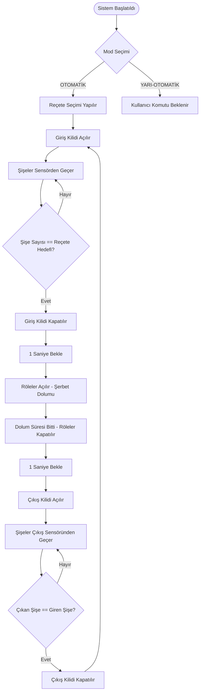
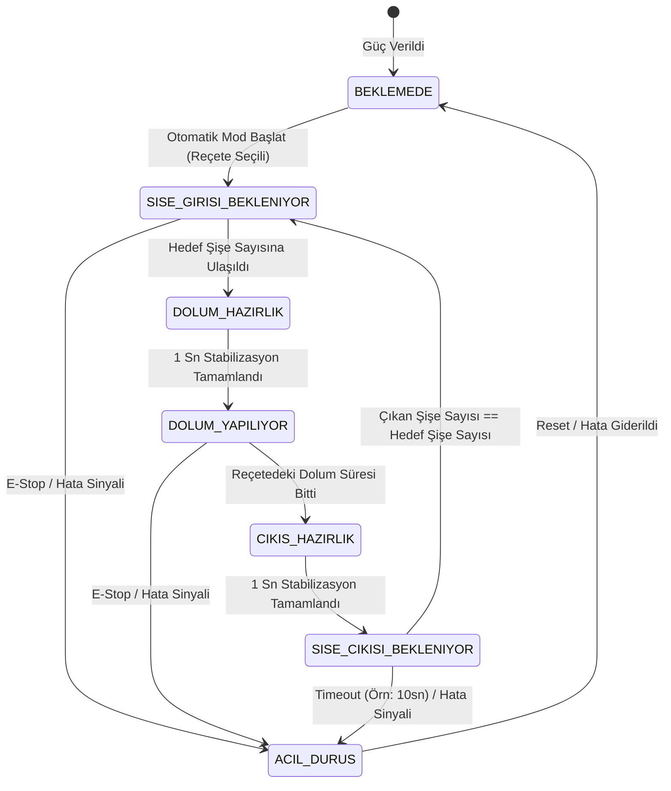
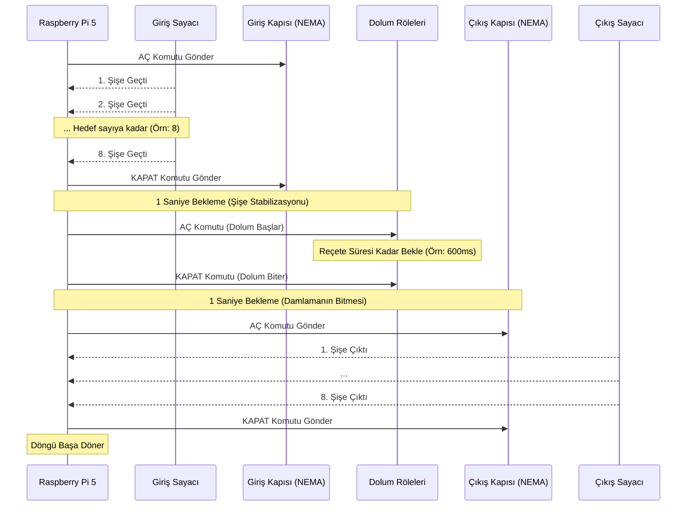
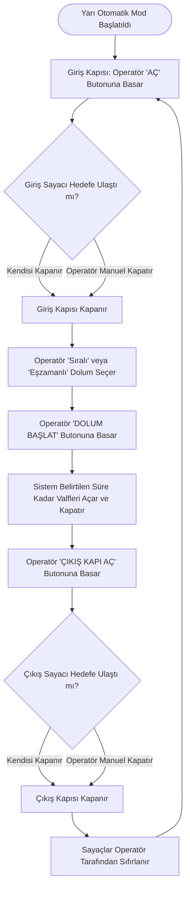

# GazozFab - Şerbet Dolum Hattı Sistem İş Akış ve Karar Analizleri

Bu doküman, GazozFab şerbet dolum hattının çalışma prensiplerini, karar algoritmalarını ve hata yönetimi stratejilerini görsel diyagramlar ve matrisler aracılığıyla özetler. Kod blokları içermez, tamamen mantıksal sistem analizi üzerine odaklanmıştır.

---

## 1. SİSTEM ANA AKIŞ FLOWCHART

Sistemin donanım başlattıktan sonraki genel işleyiş ve döngüsünü gösteren temel akış şemasıdır.



---

## 2. DURUM GEÇİŞ DİYAGRAMI (STATE TRANSITION)

Sistemin otomasyon esnasında hangi durumlardan (state) geçtiğini ve bu durumların olaylarla nasıl tetiklendiğini gösteren durum geçiş diyagramıdır.



---

## 3. KARAR AĞACI (DECISION TREE) - HATA YÖNETİMİ

Olası arıza durumlarında sistemin kilitlenmeleri ve donmaları engellemek için izlediği karar yolları.

```mermaid
flowchart TD
    Start((Sistem Kontrolü)) --> Q1{Pi 5 ile Nanolalar Arası İletişim Var mı?}
    
    Q1 -- "Hayır (Kopukluk)" --> A1[Nano Failsafe Devreye Girer]
    A1 --> A2[Tüm Röleler ve Kapılar Kapatılır]
    A2 --> A3(((Sistem Durduruldu)))
    
    Q1 -- "Evet" --> Q2{Girişte Aynı Şişe Çift Okundu mu? (Sensör Bounce)}
    
    Q2 -- "Evet" --> B1[Yazılımsal Debounce (<50ms) Filtresi Uygula]
    B1 --> B2[Sinyali Yok Say]
    B2 --> Q3
    Q2 -- "Hayır" --> Q3
    
    Q3{Çıkış Kapısı Açıkken Süre Aşımı (Timeout) Oldu mu?}
    
    Q3 -- "Evet (Şişe Devrildi/Okunmadı)" --> C1[Alarm Üret ve Operatöre Bildir]
    C1 --> C2[Sistemi Beklemeye Al - Sonraki Adıma Geçme]
    C2 --> C3(((Müdahale Bekleniyor)))
    
    Q3 -- "Hayır" --> Q4{Şerbet Tankı Seviyesi Kritik Düşük mü?}
    
    Q4 -- "Evet" --> D1[Dolum Yapılan Şişeleri Bitir]
    D1 --> D2[Yeni Şişe Alımını Durdur (Giriş Kilitle)]
    D2 --> D3(((Şerbet Dolumu Bekleniyor)))
    
    Q4 -- "Hayır" --> Normal(((Sistem Normal Çalışıyor)))
```

---

## 4. ZAMANLAMA DİYAGRAMI (TIMING DIAGRAM)

Bir tam otomasyon döngüsü içerisindeki sinyallerin (Motor, Sensör, Röle) zamana bağlı tepkilerini gösteren şema.



---

## 5. KARAR TABLOSU (DECISION TABLE)

Farklı sistem durumlarına (Inputs) karşılık donanımların alması gereken reaksiyonlar (Outputs).

| Giriş Kapısı Durumu | Dolum İstasyonu | Çıkış Kapısı Durumu | Giren Şişe (Sayaç) | Çıkan Şişe (Sayaç) | Sistem Kararı / Yapılacak Aksiyon |
| :--- | :--- | :--- | :--- | :--- | :--- |
| **AÇIK** | Boş / Kapalı | **KAPALI** | `< Reçete Hedefi` | `0` | **Bekle:** Şişelerin geçişini saymaya devam et. |
| **AÇIK** | Boş / Kapalı | **KAPALI** | `== Reçete Hedefi` | `0` | **Aksiyon:** Giriş kapısını kapat, Dolum hazırlığına (1sn bekle) geç. |
| **KAPALI** | **AÇIK (Doluyor)** | **KAPALI** | `== Reçete Hedefi` | `0` | **Bekle:** Dolum süresinin bitmesini bekle. |
| **KAPALI** | Dolum Bitti | **KAPALI** | `== Reçete Hedefi` | `0` | **Aksiyon:** 1sn damlama beklemesi yap, Çıkış kapısını aç. |
| **KAPALI** | Dolum Bitti | **AÇIK** | `== Reçete Hedefi` | `< Giren Şişe` | **Bekle:** Şişelerin çıkışını saymaya devam et. Zaman aşımı kontrolü yap. |
| **KAPALI** | Dolum Bitti | **AÇIK** | `== Reçete Hedefi` | `== Giren Şişe` | **Aksiyon:** Çıkış kapısını kapat, Giriş kapısını aç, Sayaçları sıfırla. |
| *Fark Etmez* | *Fark Etmez* | *Fark Etmez* | `Timeout Alarmı` | *Eksik* | **Acil Müdahale:** Sisteme donma/hata kaydı düş, Moddan çık. |

---

## 6. ALTERNATİF AKIŞ - YARI OTOMATİK MOD

Sensörlerin veya döngüsel otomasyonun devre dışı olduğu, operatörün adımları kendi onay vererek yürüttüğü akış diyagramı.



---

## 7. ÖZET DURUM GEÇİŞ MATRİSİ

Mevcut duruma bir olayın/şartın (Event) uygulanmasıyla oluşacak yeni durumu özetleyen matris (State-Transition Matrix). Olayın ilgili durumda geçersiz olduğu yerler (-) ile belirtilmiştir.

| Mevcut Durum (Current State) | Olay 1: Otomatik Başlat | Olay 2: Hedef Şişe Girdi | Olay 3: Dolum Tamamlandı | Olay 4: Tüm Şişeler Çıktı | Olay 5: Hata / Acil Stop |
| :--- | :--- | :--- | :--- | :--- | :--- |
| **BEKLEMEDE** | `SISE_GIRISI_BEKLENIYOR` | - | - | - | - |
| **SISE_GIRISI_BEKLENIYOR** | - | `DOLUM_HAZIRLIK` | - | - | `ACIL_DURUS` |
| **DOLUM_HAZIRLIK** | - | - | `DOLUM_YAPILIYOR` (Süre Dolunca) | - | `ACIL_DURUS` |
| **DOLUM_YAPILIYOR** | - | - | `CIKIS_HAZIRLIK` | - | `ACIL_DURUS` |
| **CIKIS_HAZIRLIK** | - | - | - | `SISE_CIKISI_BEKLENIYOR` (1sn) | `ACIL_DURUS` |
| **SISE_CIKISI_BEKLENIYOR**| - | - | - | `SISE_GIRISI_BEKLENIYOR` | `ACIL_DURUS` (Timeout/Stop) |
| **ACIL_DURUS** | `BEKLEMEDE` (Reset Gerekir)| - | - | - | - |
